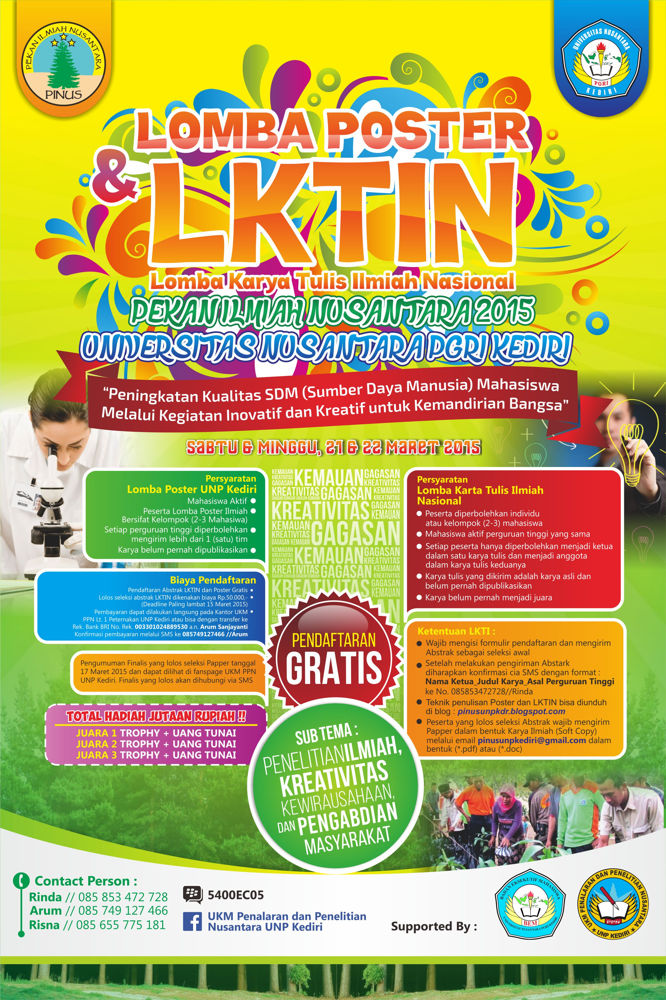

## Waktu Pelaksanaan

1. Penerimaan Abstrak 26 Februari - 5 Maret 2015
1. Pengumuman Abstrak yang Lolos  6 Maret 2015
1. Penerimaan Berkas Karya Tulis Soft Copy 6-14 Maret 2015
1. Penilaian Karya Tulis 15-16 Maret 2015
1. Pengumuman Finalis yang lolos 17 Maret 2015
1. Registrasi dan Pembayaran finalis 17- 20 Maret 2015
1. Grand Final 22 Maret 2015

## Download Panduan dan Formulir

* Formulir download [disini](/files/formulir-lktin-pinus.docx)
* Panduan download [disini](/files/panduan-lktin-pinus.pdf)
