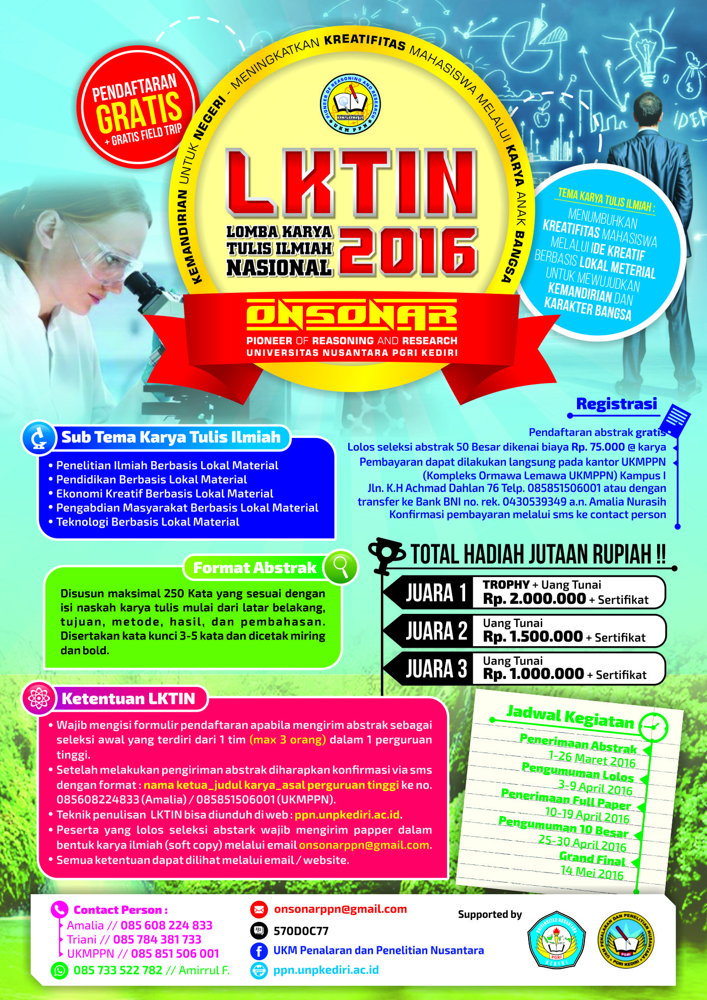

# Pendaftaran Gratis

UKM Penalaran dan Penelitian bekerjasama dengan BEM Universitas Nusantara PGRI Kediri Mengundang seluruh mahasiswa Indonesia untuk memberdayakan penelitian dan pengabdian berupa lomba-lomba tingkat nasional.

Onsonar merupakan singkatan dari Poiner of Reasoning and Research Universitas Nusantara PGRI Kediri. Tema Karya Tulis Ilmiah adalah Menumbuhkan ***Kreatifitas*** Mahasiswa Melalui ***Ide Kreatif*** Berbasis ***Lokal Material*** untuk Mewujudkan ***Kemandirian*** dan ***Karakter Bangsa***. 

## Sub Tema Karya Tulis Ilmiah

* Penelitian Ilmiah Berbasis Lokal Material
* Pendidikan Berbasis Lokal Material 
* Ekonomi Kreatif Berbasis Lokal Material
* Pengabdian Masyarakat Berbasis Lokal Material
* Teknologi Berbasis Lokal Material

## Format Abstrak

Disusun maksimal 250 kata yang sesuai dengan isi naskah karya tulis mulai dari latar belakang, tujuan metode, hasil dan pembahasan. disertakan kata kunci 3-5 kata dan dicetak miring dan bold.

> Contoh format pengiriman abstrak : LKTIN_3-KATA-JUDUL-AWAL_ASAL-UNIVERSITAS.pdf

- Format penulisan paper dapat di download [disini](/files/onsonar/pFormat-Penulisan-Paper.doc)
- Formulir pendaftaran LKTIN download [disini](/files/onsonar/Fromulir_Pendaftaran.doc)
- Panduan LKTIN download [disini](/files/onsonar/Panduan-jadi-2.pdf)

## Ketentuan LKTIN

* Wajib mengisi formulir pendaftaran apabila mengirim abstrak sebagai seleksi awal yang terdiri dari 1 tim (max 3 orang) dalam 1 perguruan tinggi.
* Setelah melakukan pengiriman abstrak diharapkan konfirmasi via sms dengan format: nama-ketua_judul-karya_asal-perguruan-tingi ke no 085608224833(Amalia)/085851506001(UKMPPN).
* Peserta yang lolos seleksi abstrak wajib mengirim paper dalam bentuk karya ilmiah (soft copy) melalui email `onsonarppn@gmail.com`.
* 

## Jadwal Kegiatan

| No. | Kegiatan | Waktu |
|:--------|:-------|:--------|
| 1. | Penerimaan Abstrak   | 1-26 Maret 2016 |
|----
| 2. | Pengumuman Lolos   | 3-9 April 2016 |
|----
| 3. | Penerimaan Full Paper   | 10-219 April 2016 |
|----
| 4. | Pengumuman 10 Besar | 25-30 April 2016 |
|----
| 5. | Grand Final | 14 Mei 2016 |
|----
{: rules="groups"}

## Registrasi
* Pendaftaran Abstrak Gratis
* Lolos Seleksi Abstrak 50 Besar dikenai biaya Rp. 75.000 @ karya
* Pembayaran dapat dilakukan langsung pada kantor UKMPPN (Kompleks Ormawa Lemawa UKMPPN) Kampus I
* Jln. KH. Achmad Dahlan 76 Telp. 085851506001 atau dengan transfer ke Bank BNI no. Rek. 0430539349 a.n. Amalia Nurasih.
* Konfirmasi pembayaran melalui sms ke contact person.

### Contact Person

* Amalia : 085608224833
* Triani : 085784381733
* UKMPPN : 085851506001
* WA 	 : 085733522782
* BBM	 : 570D0C77

### Social Media

- Fanspage: [UKM PPN](https://www.facebook.com/ukm.ppn.unpkediri)
- email	  : onsonarppn@gmail.com

Jika ada pertanyaan seputar kegiatan ini anda bisa chat ke contact person yang tersedia atau anda dapat chat dibawah postingan ini. Terima kasih.
{: .notice}
