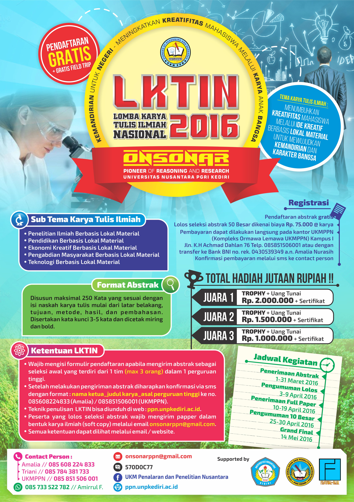

# Berita Terbaru

Pengumuman tentang 50 abstrak yang lolos akan di post kan pada tanggal 09 April 2016.
jadi ditunggu pengumuman selanjutnya dari pihak panitia ONSONAR UNP PGRI Kediri.

Terima kasih
Admin PPN
