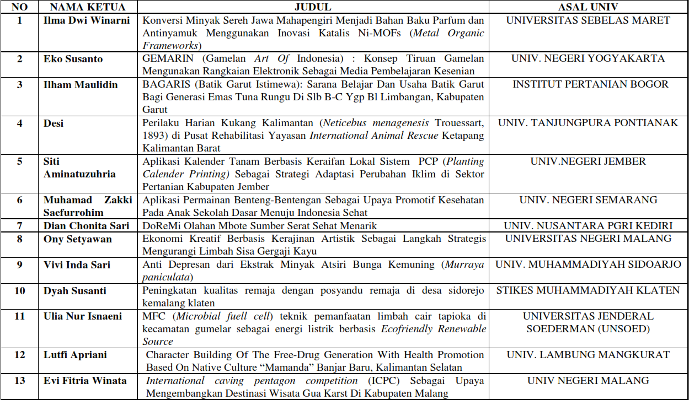
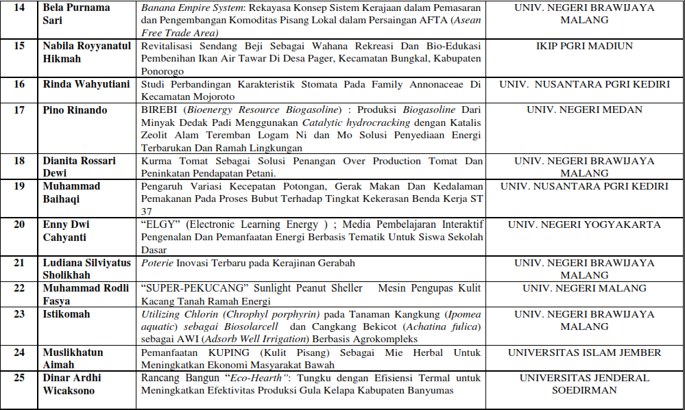
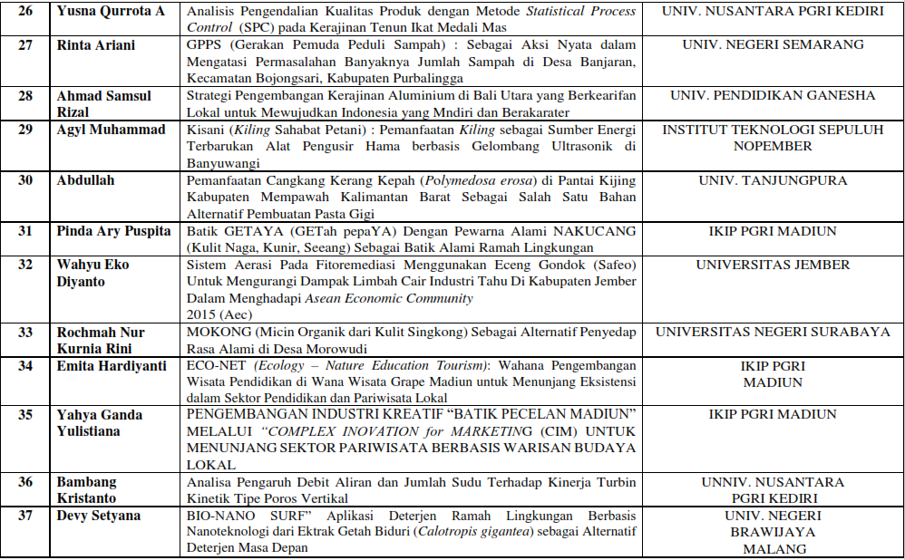
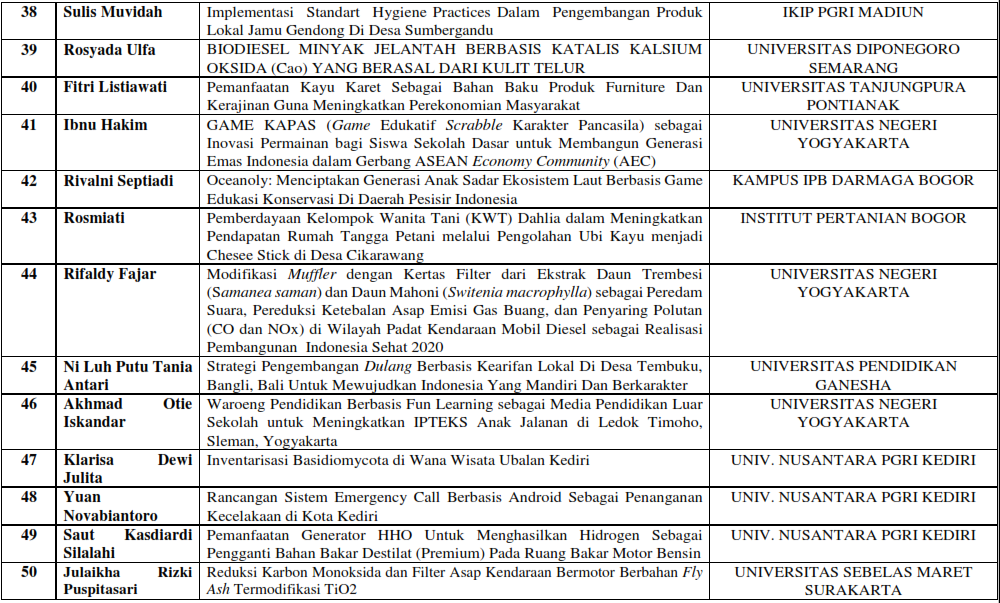

## Overview

Salam semangat... untuk seluruh peserta LKTIN ONSONAR 2016 
Terdapat 120 karya tulis yang masuk dari berbagai perguruan tinggi di Indonesia. Namun hanya 50 karya yang masuk lolos seleksi abstrak.
SELAMAT bagi karya tulis yang lolos seleksi abstrak 50 besar  . Dimohon  untuk segera registrasi dan mengirimkan fullpaper (Sesuai sistematika) untuk seleksi lolos finalis 10 besar. Terima kasih.
NB: Terakhir registrasi pengumpulan fullpaper tanggal 19 April 2016 

### Pembayaran registrasi peserta lolos Abstrak :

- Besar 		: **Rp. 75.000** 
- Bank BRI 	 	: **0430539349** 
- Atas nama  	: an *Amalia Nurasih* 

Setelah melakukan pembayaran peserta wajib regristrasi dengan mengirim sms ke no **085608224833** (Amalia) dengan format: 

> LKTIN_Nama Lengkap/Ketua_Asal Universitas_3 Kata Pertama judul LKTI. 

Bukti scan Pembayaran yang dikirim ke email: `onsonarppn@gmail.com`

## Berikut Daftar Nama Lolos Abstrak

