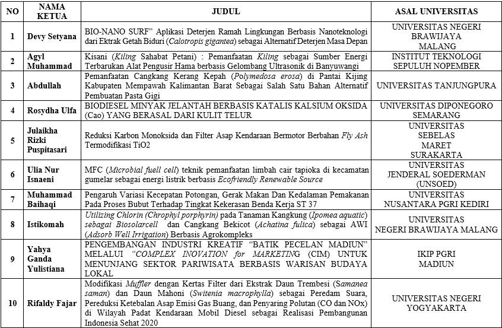

## Overview

SELAMAT bagi para finalis yang telah lolos 10 besar pada kegiatan LKTIN ONSONAR 2016. GRAND FINAL akan dilaksanakan pada tanggal 14 Mei 2016, yang bertempat di Hall Kampus 2 Universitas Nusantara PGRI Kediri.
Bagi tim lolos abstrak 50 besar yang telah melakukan registrasi akan diberikan sertifikat pada tanggal 02 Mei 2016 yang diupload di website ini.

## Berikut Daftar Nama Finalis 10 Besar

atau bisa didownload dalam format PDF 
klik [di sini](/files/Lolos 10 Besar Fullpaper.pdf)

Hadiah jutaan rupiah menantimu...!!!

Tetap berpikir ilmiah dalam memecahkan suatu masalah. Semangat!!!

Salam ONSONAR..

Salam Berbinar..
