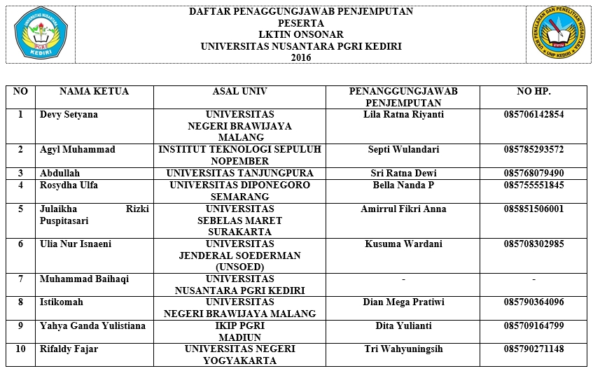

Kali ini admin akan membagikan daftar LO atau Pendamping Teman-teman tim Finalis berkunjung di Kediri.
Saat penjemputan dan saat ingin menanyakan sesuatu bisa melalui LO atau pendamping masing-masnig tim.

Atau bisa diunduh dalam format PDF [di sini](/files/onsonar/DAFTAR PENAGGUNGJAWAB PENJEMPUTAN.pdf)

Untuk konfirmasi tempat menginap dan saat telah tiba di titik penjemputan bisa langsung ke LO masing-masing tim.

Jika link unduh yang mati, bisa memberikan komentar pada post ini.

Tetap berpikir ilmiah dalam memecahkan suatu masalah. Semangat!!!

Salam ONSONAR..

Salam Berbinar..

Terima Kasih Admin PPN
