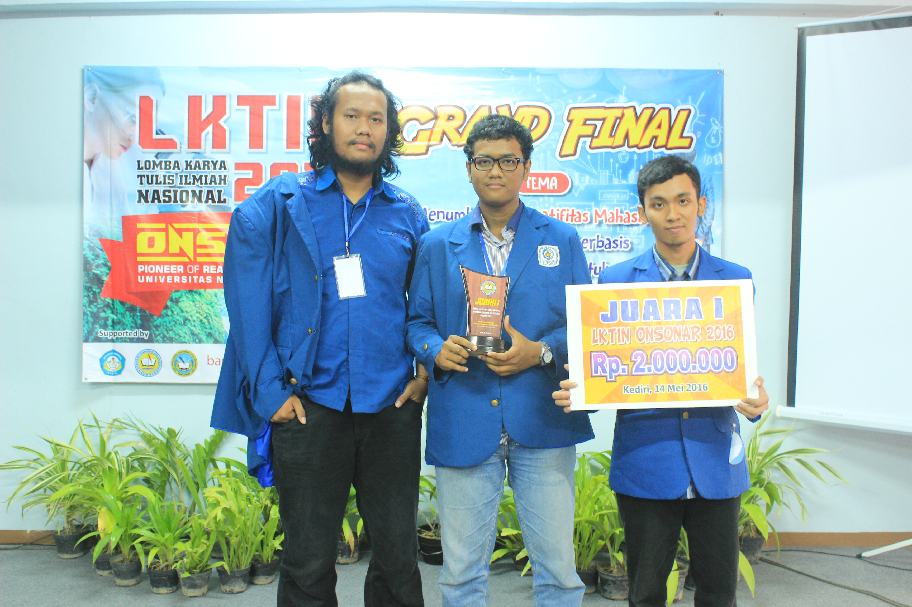
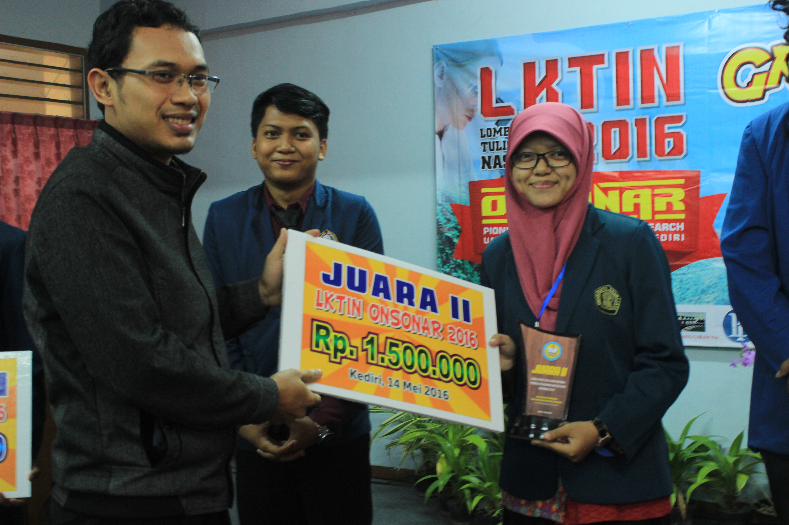
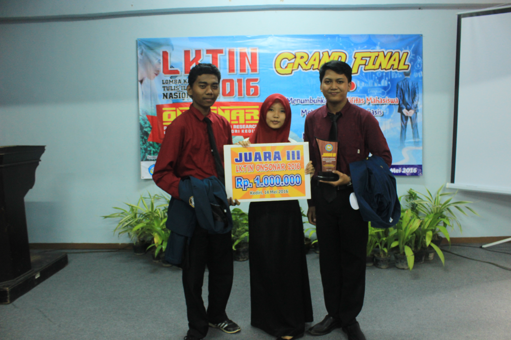
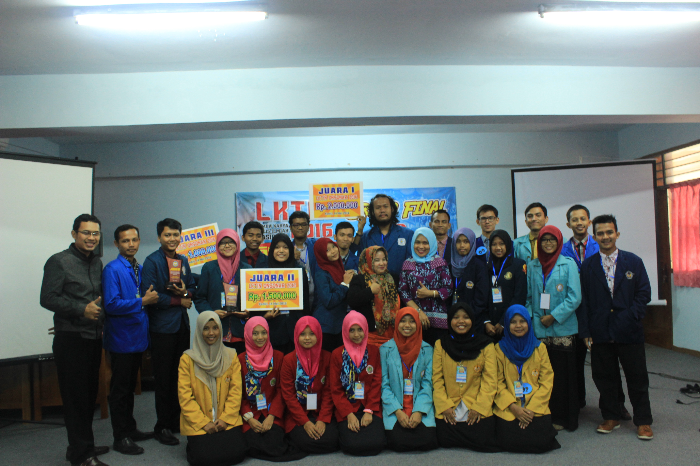

Kali ini admin akan mengumumkan hasil Grand Final kemarin yang diadakan di Kampus 1 UNP Kediri tanggal 14 Mei 2016.

# Juara 1 : Tim Agyl Muhammad dari Institut Teknologi Sepuluh Nopember

# Juara 2 : Tim Devy Setyana dari Universitas Negeri Brawijaya Malang

# Juara 3 : Tim Rosydha Ulfa dari Universitas Diponegoro Semarang

Dokumentasi Hasil Kegiatan Grand Final kemarin akan diposting besok, jadi tetap stay tune.

Selamat bagi ketiga tim yang telah menjadi juara LKTIN ONSONAR 2016.
Tetap berpikir ilmiah dalam memecahkan suatu masalah. Semangat!!!

Salam ONSONAR..

Salam Berbinar..

Terima Kasih
Admin PPN
