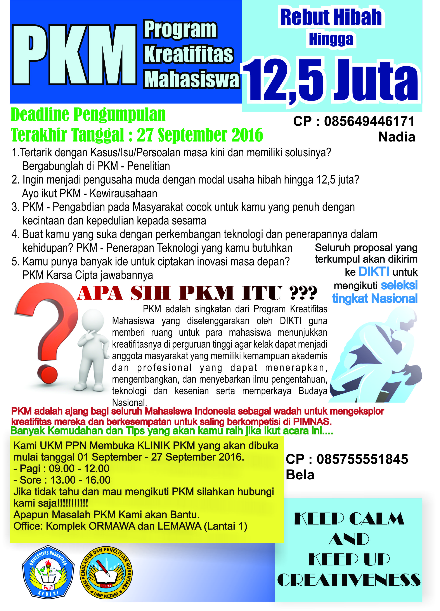

## Overview

Setelah kegiatan LKTIN ONSONAR 2016 kemarin, kami UKM PPN kembali mengadakan kegiatan berupa Sosialisasi PKM 2016 yang mana
tujuan dari acara ini adalah mengenalkan apa itu Program Kreatifitas Mahasiswa (PKM) serta memberikan tips agar proposal
kegiatanmu nanti dapat lolos dalam seleksi tingkat nasional dari pihak DIKTI.

Kegiatan ini dilaksanakan pada tanggal 12 September 2016 di Hall Kampus 2 UNP Kediri.

Acara dimulai pukul 13.00 - selesai.

Berikut Admin bagi juga file-file guna menunjang pembuatan proposal PKM kamu:
1. Tim PKM yang lolos tahun 2014. klik [di sini](/files/Re-Organisasi/SOSIALISASI PKM TAHUN 2015/daftar peserta PKM yang lolos Pendanaan Tahun 2014.pdf)
 
2. Tim Pemenang PKM tahun 2015. klik [di sini](/files/Re-Organisasi/SOSIALISASI PKM TAHUN 2015/lampiran-Pemenang-pemenang-PKM-tahun-anggaran-20151.pdf)
 
3. Pedoman Pembuatan PKM 2015. klik [di sini](/files/Re-Organisasi/SOSIALISASI PKM TAHUN 2015/Pedoman PKM Tahun 2015.pdf)

4. Panduan Penggunaan SIMLITABMAS guna pengajuan Tim dan Proposal PKM. klik [di sini](/files/Re-Organisasi/SOSIALISASI PKM TAHUN 2015/PKM Panduan Mahasiswa.pdf)

Admin juga bagikan contoh Proposal PKM 5 Bidang dari Mahasiswa UNP Kediri yang telah lolos seleksi nasional DIKTI. klik [di sini](/files/Sosialisasi/PROPOSAL PKM YANG DIDANAI.rar)

UKM PPN juga membuka klinik tentang PKM guna mempermudah kamu dalam mengatasi masalah tentang proposal yang kamu buat, dibuka mulai 01 September nanti samapi 27 September 2016.

Jam Buka - Pagi : 09.00 - 12.00
         - Sore : 13.00 - 16.00
         
Bertempat di Komplek ORMAWA dan LEMAWA lantai 1.

## Contact Person
* Nadia : 085649446171
* Bela : 085755551845

Jika ada pertanyaan seputar kegiatan ini anda bisa chat ke contact person yang tersedia atau anda dapat chat dibawah postingan ini. Terima kasih.
